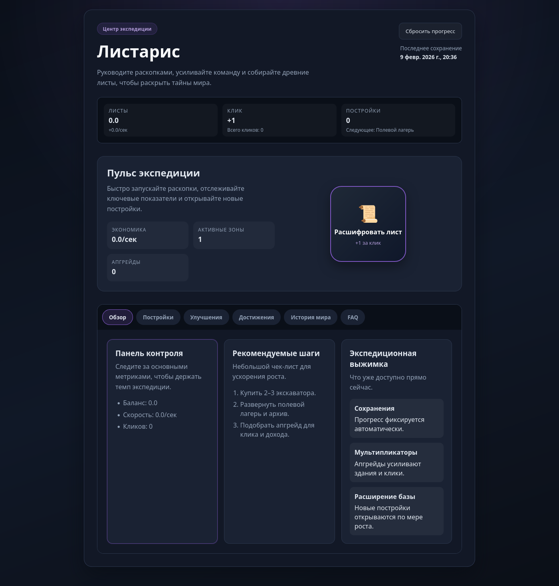

<p align="center">
  
</p>

# Листарис

Инкрементальная игра-симулятор экспедиции, где игрок развивает археологическую базу, расшифровывает хроники и управляет сетью раскопок.

## Что внутри проекта

- **Переработанный UI** с акцентом на читаемость и быстрые действия.
- **Система сохранений** на основе localStorage.
- **Линейка построек и улучшений**, которая поддерживает рост экономики.
- **Достижения, FAQ и история мира** прямо в интерфейсе.

## Быстрый старт

```bash
npm install
npm run dev
```

Приложение будет доступно по адресу `http://localhost:5173`.

## Сборка

```bash
npm run build
npm run preview
```

## Структура проекта

```
src/
  components/   # UI-компоненты
  modules/      # Игровые данные и утилиты
  styles/       # Базовые стили и темы
```

## Основные механики

- Клик по кнопке «Расшифровать лист» даёт базовый доход.
- Постройки повышают автодобычу в секунду.
- Улучшения усиливают здания и клики, показывая актуальный прирост.
- Прогресс сохраняется автоматически каждые несколько секунд.

## Лицензия

Коммерческое использование и продажа разрешены после согласования с владельцем репозитория.
